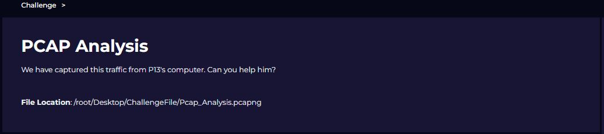
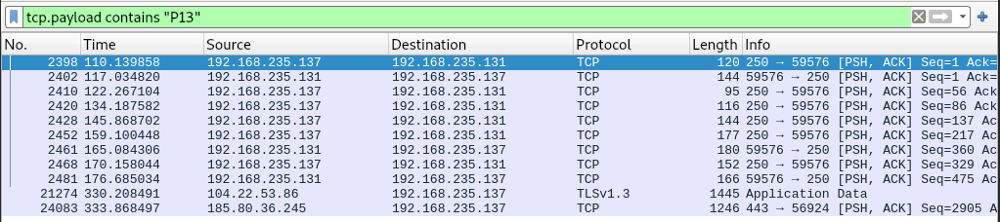
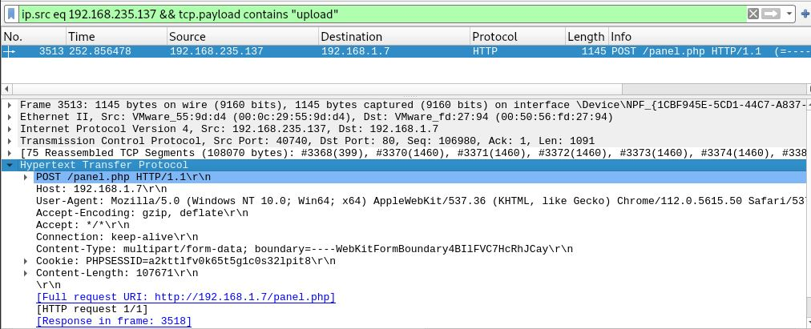
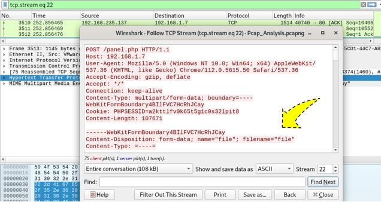
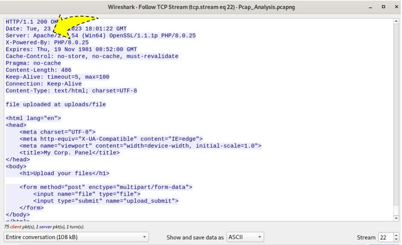
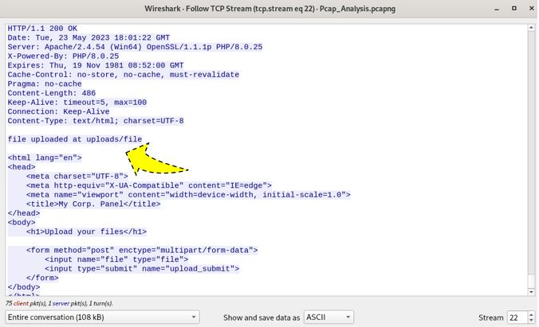
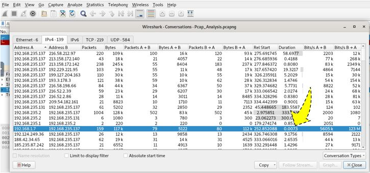

# *DISCLAIMER*

Este contenido inicialmente es de caracter personal y de estudio constantey recurrente, adicional quiero compartir con fines informativos y de aprendizaje para otros profesionales. Es de aclarar que, los ejemplos y escenarios presentados son hipotéticos, así mismo, las plataformas utilizadas son públicas en donde pueden reflejar situaciones reales de las compñaías, estás plataformas publican laboratorias con diferentes escenarios. Las tecnologías al igual que las herramientas mencionadas están sujetas a cambios constantes.

# LetsDefend | PCAP Analysis

    Rol: Security Analyst
    Dificultad: Beginner
    Escenario: Análisis de archivo PCAP (Tráfico de red)

### 1. ¿En la comunicación en red, ¿Cuales son las direcciones IP del emisor y del receptor?

Filtro: tcp.payload contains "P13"

- tcp.payload: Nos ayuda a buscar información dentro de todos los paquetes TCP que contengan la palabra buscada entre las doble comillas.

    192.168.235.137,192.168.235.131

### 2. ¿P13 ha subido un archivo al servidor web. ¿Cuál es la dirección IP del servidor?

Filtro: ip.src eq 192.168.235.137 && tcp.payload contains "upload"

- ip.src: IP de origen del host
- tcp.payload: Paquete TCP que contenga la palabra "upload"

    192.168.1.7

### 3. ¿Cuál es el nombre del archivo que se ha enviado a través de la red?

Sobre el filtro que ya tenemos aplicado, damos clic derecho >> FOLLOW >> TCP STREAM. Ahí vemos el nombre del archivo.

    file

### 4. ¿Cuál es el nombre del servidor web donde se subió el archivo?

Dentro de este mismo TCP STREAM, vamos al final del paquete donde está la respuesta a la petición HTTP ubicamos el nombre Servidor Web: Apache/2.4.54

    Apache

### 5. ¿Cual fue el directorio en el que fue subido el archivo?

En la misma imagen de este TCP STREAM ubicamos el nombre del directorio.

    uploads

### 6. ¿Cuánto tardó el remitente en enviar el archivo cifrado?

# Herramientas Utilizadas | Recursos

- Es importante conocer algunos filtros o flags que utiliza el Wireshark. Guía de uso en el siguiente enlace "https://www.wireshark.org/docs/dfref/"
